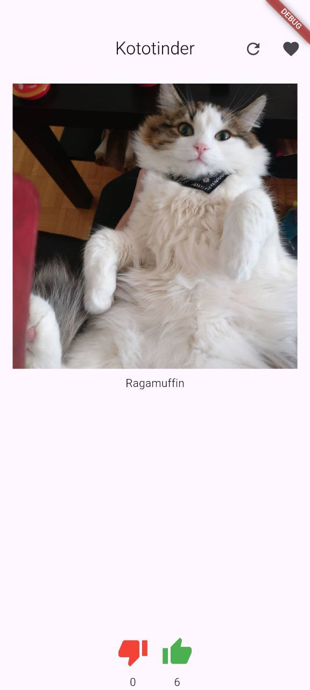
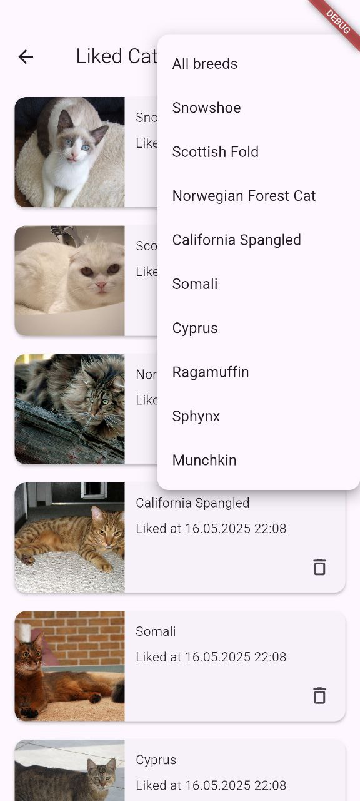
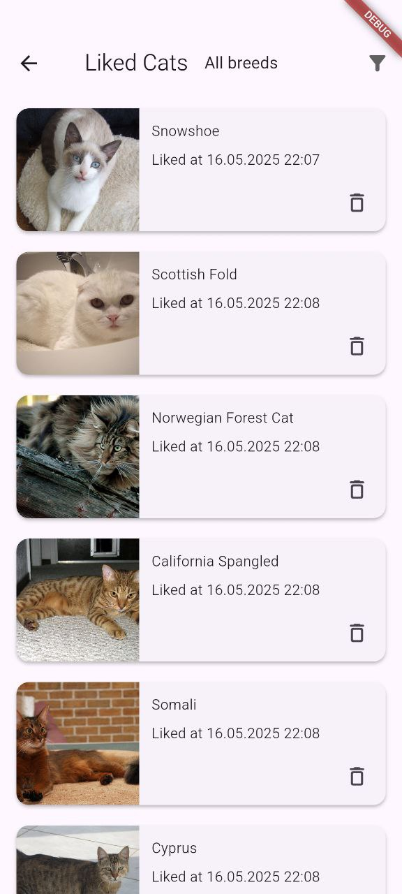
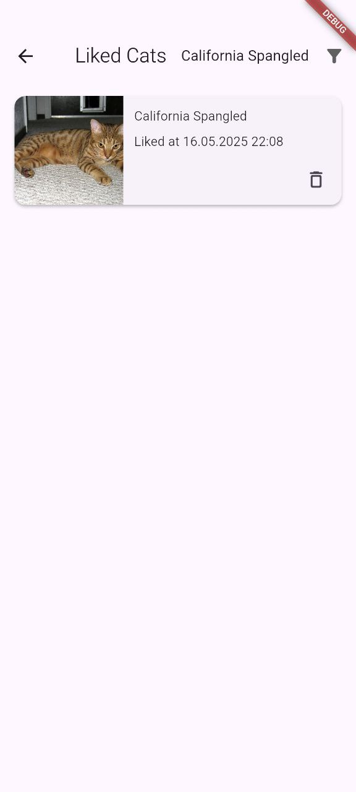

# Kototinder PRO

Kototinder — это мобильное приложение на Flutter, которое позволяет просматривать изображения котиков, ставить им лайки и узнавать больше о породах.

## Функциональность 
- Главный экран отображает случайное изображение котика и его породу.
- Можно свайпать котиков влево/вправо или использовать кнопки «лайк»/«дизлайк».
- При лайке (свайп вправо или нажатие кнопки) увеличивается счётчик лайков.
- При дизлайке (свайп влево или нажатие кнопки) увеличивается счётчик дизлайков.
- Нажатие на изображение котика открывает экран с детальным описанием.
- На экране детального описания показывается изображение котика и информация о его породе.
- Добавлен экран лайкнутых котиков со скроллящимся списком с изображением, породой и датой лайка.
- Есть возможность фильтрации списка по породе и удаления карточки из списка.
- При длительной загрузке приложение показывает progress bar.
- При ошибке сети отображается диалог с ошибкой.
## Новая функциональность
- Приложение работает в оффлайн-режиме: отображает ранее загруженных котиков.
- Количество лайков, дизлайков и список лайкнутых котиков сохраняются между выходами из приложения.

## Скриншоты

### Главный экран

### Детальное описание

### Фильтр

### Экран лайкнутых котиков

## Сcылка на APK

[apk](apk/app-release.apk)