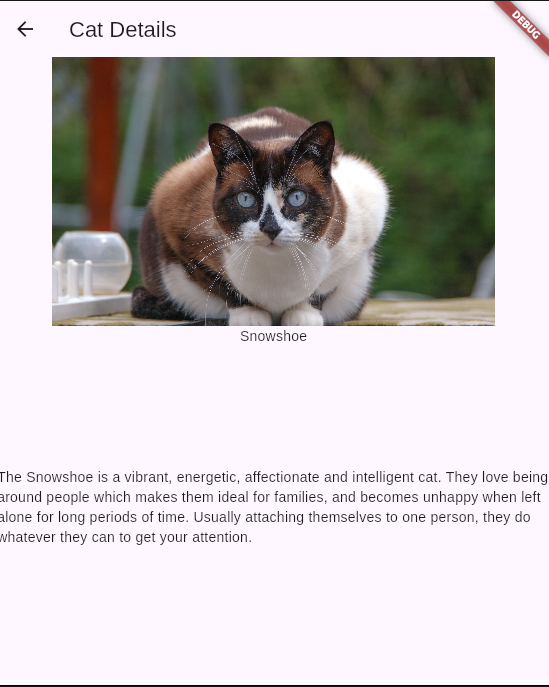

# Kototinder

Kototinder — это мобильное приложение на Flutter, которое позволяет просматривать изображения котиков, ставить им лайки и узнавать больше о породах.

## Функциональность
- Главный экран отображает случайное изображение котика и его породу.
- Можно свайпать котиков влево/вправо или использовать кнопки «лайк»/«дизлайк».
- При лайке (свайп вправо или нажатие кнопки) увеличивается счётчик лайков.
- При дизлайке (свайп влево или нажатие кнопки) увеличивается счётчик дизлайков.
- Нажатие на изображение котика открывает экран с детальным описанием.
- На экране детального описания показывается изображение котика и информация о его породе.

## Скриншоты

### Главный экран

### Детальное описание

## Сcылка на APK

[apk](apk/app-release.apk)